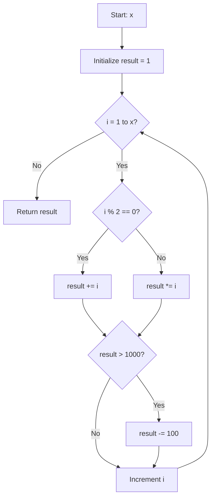

## Flowchart: transform_complex



## Flowchart: evaluate_sequence

```mermaid
flowchart TD
    A[Start] --> B[Initialize state = 0]
    B --> C{i < len?}
    C -- No --> H[switch(state)]
    C -- Yes --> D{arr[i] < 0?}
    D -- Yes --> E[state = -1]
    D -- No --> F{arr[i] == 0?}
    F -- Yes --> G[state = 0]
    F -- No --> I[state = 1]
    E --> J{state == 1?}
    G --> J
    I --> J
    J -- Yes --> H
    J -- No --> K[i++]
    K --> C
    H --> L{state == 1?}
    L -- Yes --> M[Return true]
    L -- No --> N[Return false]
```

